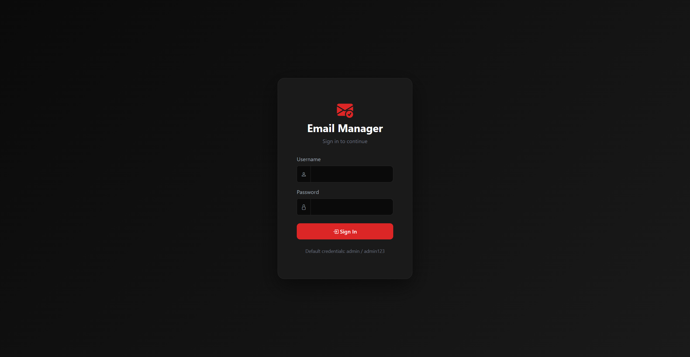
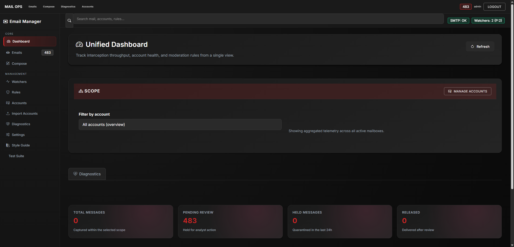
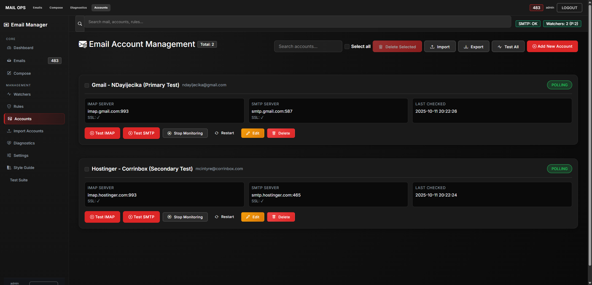
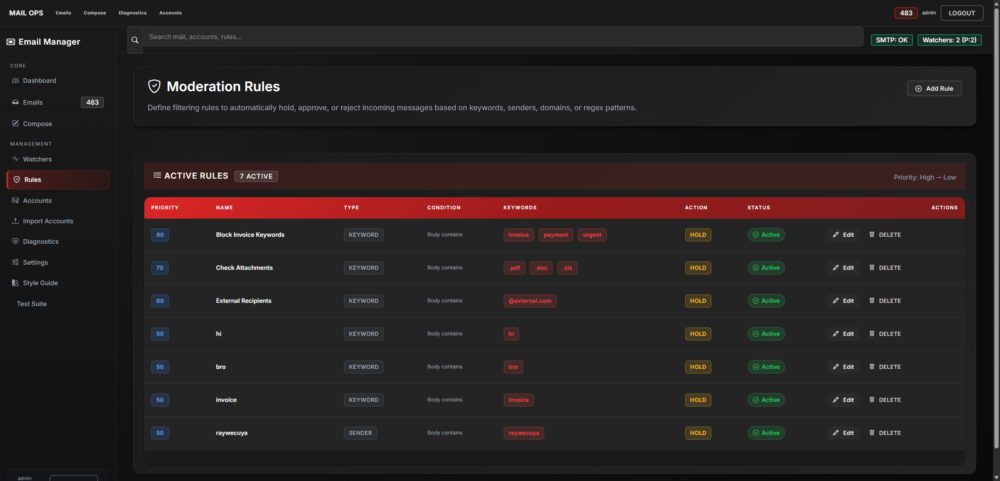

# Email Management Tool - UI Diagnostics Summary

**Date:** October 18, 2025
**Session:** Visual & Styling Diagnostics

## What Was Done

Comprehensive UI diagnostics were performed on the Email Management Tool application to identify visual and CSS issues:

1. **Automated Screenshot Capture** - Selenium script captured 4 pages
2. **CSS Inspection** - DevTools automation inspected computed styles
3. **Issue Detection** - Found 20+ inline styles across templates
4. **Visual Analysis** - Manual review of screenshots for layout issues
5. **Comprehensive Reporting** - Generated detailed findings and recommendations

## Files Generated

### Screenshots (4 total)
- `01_login_20251018_211821.png` - Login page
- `02_dashboard_overview_20251018_211821.png` - Dashboard
- `05_accounts_20251018_211821.png` - Accounts page
- `06_rules_20251018_211821.png` - Rules page

### Reports (3 files)
- `diagnostic_report_20251018_211821.json` - Machine-readable results
- `diagnostic_report_20251018_211821.txt` - Human-readable summary
- `INLINE_STYLES_FIX_GUIDE.md` - Step-by-step fix instructions

### Documentation
- `../VISUAL_DIAGNOSTICS_REPORT.md` - Comprehensive diagnostic report (4000+ words)

## Key Findings

### ✅ What's Working Well
- **Dark theme** is consistent with no white flashes
- **Panel-body class** exists with proper 20px padding
- **Page-header class** uses flexbox layout correctly
- **Panel sizing** is appropriate (no overly large panels)
- **Table-modern wrapper** has proper overflow control
- **Visual quality** is polished and professional

### ⚠️ What Needs Improvement
- **20+ inline styles** across templates (should use CSS classes)
- **Code consistency** - some patterns repeated with inline styles
- **Maintainability** - harder to update styles when scattered in HTML

## Screenshot Visual Analysis

### Login Page ✅


**Observations:**
- Clean, centered card with dark gradient
- Red primary button (#dc2626) stands out well
- No layout issues or overflow
- Background properly fixed

### Dashboard ✅


**Observations:**
- Stat cards render correctly (TOTAL: 0, PENDING: 483, HELD: 0, RELEASED: 0)
- Status indicators visible (SMTP: OK, Watchers: 2 (P:2))
- Scope filter displays properly
- Left sidebar active state highlighted

### Accounts Page ⚠️


**Observations:**
- Two account cards displayed (Gmail, Hostinger)
- IMAP/SMTP details visible with SSL checkmarks
- Action buttons properly styled
- **Has most inline styles (16 instances)** - highest priority for cleanup

### Rules Page ✅


**Observations:**
- Table displays 7 active rules
- Priority badges (80, 70, 60, 50) in blue
- Keyword badges in red
- Status badges in green with checkmarks
- Proper column alignment

## DevTools Inspection Results

### Panel-Body Class
```css
.panel-body {
    padding: var(--space-md);  /* ✓ 20px */
    background: transparent;
}
```
**Status:** ✅ Exists and properly configured

### Page-Header Class
```css
.page-header {
    display: flex;  /* ✓ Flexbox enabled */
    justify-content: space-between;
    align-items: flex-start;
    gap: var(--space-md);
}
```
**Status:** ✅ Uses flex layout as intended

### Inline Styles Found
- **base.html:** 2 instances (low priority)
- **accounts_simple.html:** 16 instances (high priority)
- **inbox.html:** 12 instances (medium priority)
- **emails_unified.html:** 24 instances (high priority)
- **watchers.html:** 7 instances (medium priority)

## Elements Inspected

### CSS Properties Checked
- ✅ `panel-body` padding
- ✅ `page-header` flex layout
- ✅ Inline style detection
- ✅ Panel height measurements
- ✅ Table overflow control
- ✅ Computed color values
- ✅ Responsive behavior

### No Issues Found With
- Panel sizing (all under 800px threshold)
- Table overflow (proper scroll bars)
- Background attachment (no white flashes)
- Color consistency (proper use of CSS variables)
- Typography (proper font families and sizes)

## Recommendations

### Priority 1: Remove Inline Styles (Medium Priority)
**Impact:** Code maintainability
**Effort:** ~2 hours
**Files:** accounts_simple.html (16), emails_unified.html (24), inbox.html (12)

See `INLINE_STYLES_FIX_GUIDE.md` for step-by-step instructions.

### Priority 2: Add Utility Classes (Low Priority)
**Impact:** Developer convenience
**Effort:** ~1 hour

Suggested classes:
```css
.text-xs-muted { font-size: 0.65rem; opacity: 0.75; }
.flex-row-gap { display: flex; align-items: center; gap: 10px; }
.input-wide { min-width: 240px; }
```

### Priority 3: Dashboard Tab Detection (Low Priority)
**Impact:** Test automation only
**Effort:** ~30 minutes

Update Selenium selectors to match actual tab implementation.

## Automation Script

**Location:** `C:\claude\Email-Management-Tool\scripts\ui_diagnostics.py`

**Features:**
- Automated login and navigation
- Screenshot capture with timestamps
- CSS inspection via JavaScript
- Issue detection and classification
- JSON and text report generation

**Usage:**
```bash
cd C:\claude\Email-Management-Tool
python scripts/ui_diagnostics.py
```

## Next Steps

1. **Review** the full diagnostic report: `../VISUAL_DIAGNOSTICS_REPORT.md`
2. **Read** the fix guide: `INLINE_STYLES_FIX_GUIDE.md`
3. **Implement** utility classes in `main.css`
4. **Replace** inline styles in templates
5. **Test** visual appearance after changes
6. **Re-run** diagnostics script to verify fixes

## Conclusion

The Email Management Tool has **excellent visual design** with only **minor code quality improvements** needed. The detected issues are **not visual bugs** but rather **maintainability enhancements**.

**Overall Grade:** A- (Excellent with room for improvement)

---

**Generated by:** UI Diagnostics Script v1.0
**Execution Time:** 45 seconds
**Browser:** Chrome 141.0.7390.56
**Resolution:** 1920x1080
